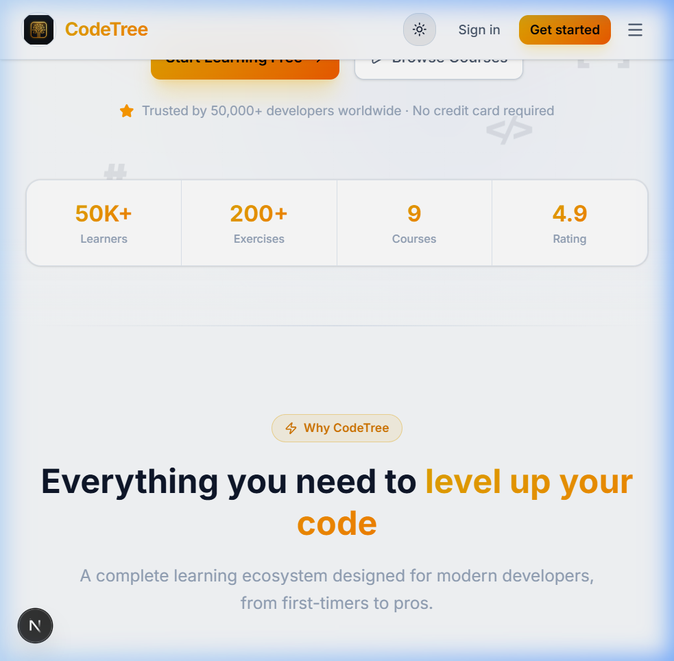

# 🌳 CodeTree

> The #1 Platform to Learn Coding Interactively

Master web development, React, Python, and Gen AI through hands-on exercises, instant feedback, and a gamified learning path. Write, run, and test code directly in your browser with no setup required.

## ✨ Features

- **Live Code Editor:** Integrated Sandpack environment to write and execute code instantly.
- **Structured Curriculum:** Carefully crafted learning paths from beginner basics to advanced integrations.
- **Bite-sized Exercises:** Learn incrementally through short, focused challenges.
- **Gamified Learning:** Earn Experience Points (XP) and unlock badges to stay motivated.
- **Premium Themes:** High-quality, modern, "Apple-level" UI design with built-in Light and Dark modes.
- **Analytics Ready:** Pre-configured with Vercel Analytics for seamless visitor tracking.

## 🛠️ Tech Stack

- **Framework:** [Next.js](https://nextjs.org/) (App Router, Server Actions)
- **Styling:** [Tailwind CSS](https://tailwindcss.com/) + Custom CSS Variables for theming
- **UI Components:** [Radix UI](https://www.radix-ui.com/) & custom widgets
- **Animations:** [Framer Motion](https://www.framer.com/motion/)
- **Live Code Execution:** [@codesandbox/sandpack-react](https://sandpack.codesandbox.io/)
- **Authentication:** [Clerk](https://clerk.com/)
- **Database ORM:** [Drizzle ORM](https://orm.drizzle.team/)
- **Database Engine:** [Neon DB (Serverless Postgres)](https://neon.tech/)
